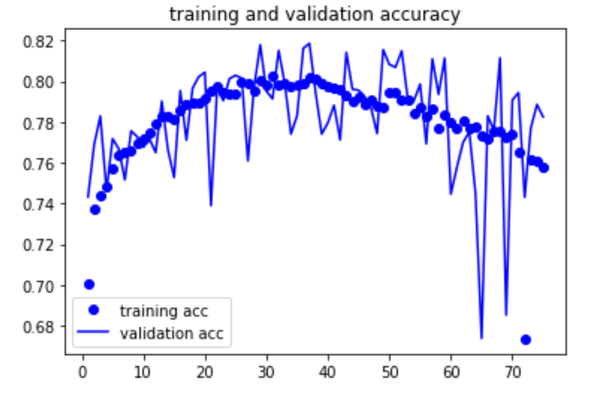
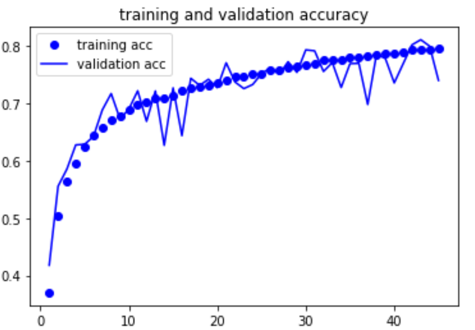

# CIFAR 10 -- HOMEWORK 2
Ot Gabaldon Torrents  
CAP 5610
Each python notebook is in the github repo, Google Collab notebooks are based off of final revision.
## CNN 
V1.4 https://colab.research.google.com/drive/1o8crFb4Sw0IJj8YcpexO1mCqVHuws_hB#scrollTo=AxJKjJ5oNRGi
#### (1.1) Original
| Metric| Value |
|-------|-------|
|Epochs|30|
|Number of Layers| **9** (3 Conv, 3 Pooling, 2 Dense, 1 Flattening)| 
|Accuracy - Training| 10.05% |
|Accuracy - Validation| 9.8% |  
|Accuracy - Test| 10% |  
#### Thoughts 
The model is not learning. The final pooling layer might push the convolutions to too small of an dimension to detect meaningful weights between pixels
#### (1.2) Increase Filters (layer 2 : 32 -> 64, layer 3 : 32 -> 128), Changed optimizer from adam to rmsprop (lr=0.001) 
| Metric| Value |
|-------|-------|
|Epochs|30|
|Number of Layers| **8** (3 Conv, 2 Pooling, 2 Dense, 1 Flattening) | 
|Accuracy - Training| 9.80% |
|Accuracy - Validation| 9.67% |  
|Accuracy - Test| 9.43% |  
#### (1.3) Doubled Convolutional Layers, Added batch_size -> 64
| Metric| Value |
|-------|-------|
|Epochs|30|
|Number of Layers| **11** (6 Conv, 2 Pooling, 2 Dense, 1 Flattening) | 
|Accuracy - Training| 9.96% |
|Accuracy - Validation| 9.77% |  
|Accuracy - Test| 10.71% |  
#### Thoughts
- [ ] Maybe try going straight to the final Dense classification layer.   
- [x] Increase the number of neurons in the First Dense Layer.  
- [x] Add Padding and then add an extra pooling layer.
#### (1.4) Added Padding, Added Final Pooling Layer
| Metric| Value |
|-------|-------|
|Epochs|30|
|Number of Layers| **12** (6 Conv, 3 Pooling, 2 Dense, 1 Flattening) | 
|Accuracy - Training| 96% |
|Accuracy - Validation| 76% |  
|Accuracy - Test| 60%| 
#### Thoughts
Padding allowed a large enough area for the final layer to still have enough relation between pixels to produce relevant weights.
Allowed for the layers with small area to observe very basic features.
Need to fix over fitting:
- [X] Data Augmentation
- [X] Dropout
- [X] Normilization of inputs 
- [X] Batch Normilization
- [ ] Kernal_regulizer

## Vanilla CNN with data augmentation
V2.3 https://colab.research.google.com/drive/1TrvHTXS3ouumAEQ3flq3tksAeQQlIewu#scrollTo=ycwobM-xeCYa
#### (2.1) Manually Split Training and Validation Data. Added rotation, zoom, and dimension shifts to data augmentation
| Metric| Value |
|-------|-------|
|Epochs|30|
|Number of Layers| **12** (6 Conv, 3 Pooling, 2 Dense, 1 Flattening) | 
|Accuracy - Training| 79.8%  |
|Accuracy - Validation|  77.23% |  
|Accuracy - Test| 49.8% | 
#### Thoughts
- [x] Try increasing number of epochs, since there is now more training data.
- [x] Double check that new validation style is not affecting results.
#### (2.2) Increased Epochs to 75
| Metric| Value |
|-------|-------|
|Epochs| 75 |
|Number of Layers| **12** (6 Conv, 3 Pooling, 2 Dense, 1 Flattening) | 
|Accuracy - Training| 75.7%  |
|Accuracy - Validation|  78.25% |  
|Accuracy - Test| 44.7% | 
#### Thoughts
The peak performance seems to happen around 35 epochs.  

#### (2.3) Added Batch Normilization, Increased Nodes on classifier input layer 64 -> 128, Changes epochs to 35
| Metric| Value |
|-------|-------|
|Epochs| 35 |
|Number of Layers| **18** (6 Conv, 6 Normilization, 3 Pooling, 2 Dense, 1 Flattening) | 
|Accuracy - Training| 88.42% |
|Accuracy - Validation| 81.84% |  
|Accuracy - Test| 81.29% | 
#### Thoughts
YOU HAVE TO NORMALIZE TEST IMAGES

## CNN Dropout and Data Augmentation
V3.1 https://colab.research.google.com/drive/1UGsKdLGAaIWow-juOBeUII7oj0WDqouX
#### (3.1) Added Dropout and increased Epochs to 45
| Metric| Value |
|-------|-------|
|Epochs| 45 |
|Number of Layers| **21** (6 Conv, 6 Normilization, 3 Pooling, 3 Dropout, 2 Dense, 1 Flattening) | 
|Accuracy - Training| 79.5% |
|Accuracy - Validation| 74.03% |  
|Accuracy - Test| 74.32% | 
#### Thoughts
The diffrence between Training and Test is much lower with dropout, but it needs more time to train
- [x] Increase Epochs
- [x] Decrease Dropout Rate
- [x] Add K-folds  
.
## K-folds
V4.1 https://colab.research.google.com/drive/1MaqNLpfOnlAL46aJZ3nsKjnK9k6yDUh1
#### (4.1) K-folds added, Epochs Increased to 50
| Metric| Value |
|-------|-------|
|Epochs| 50 |
|Number of Layers| **21** (6 Conv, 6 Normilization, 3 Pooling, 3 Dropout, 2 Dense, 1 Flattening) | 
|Accuracy - Training| 63.99%  |
|Accuracy - Validation|  63.7% |  
|Accuracy - Test| 79.648% | 
  
.
#### Thoughts
K-folds seems to increase the test accuracy in comparison to the validation accruacy.  
Although this method took over 30 hours to train. 
It seems that the time put into training the folds would have been better spent on more epochs,unless there is a severe lack of data then k-folds can produce good results.
